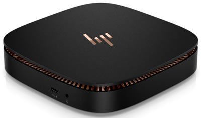
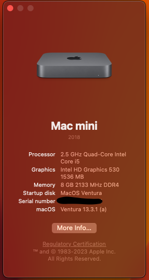
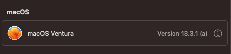

# Hackintosh HP Elite Slice G1

## Table of Contents
- [Overview](#overview)
- [Software Version](#software-version)
- [Hardware](#hardware)
- [Not working](#not-working)
- [Notes](#notes)
- [Screenshots](#screenshots)
- [Release Notes](#release-notes)
---
## Overview
_For the original (Chinese) version check out the [forked repo](https://github.com/demon3434/Hackintosh-EFI-HP_Elite_Slice)_

This is the (~~cheaper~~) more flexible version of the Mac mini.  
Although Intel Skylake is old now (2023), it is still enough for most computing tasks and I got this computer dirt cheap, so, why not experiment with it a little bit? Since the hackintosh scene [may be over soon](https://www.howtogeek.com/779378/the-hackintosh-will-soon-be-dead-and-thats-just-fine/) I decided to use this until I finally get a real Mac Mini of my own.

## Software Version
| Software | Version |
| --- | :--: |
| OS | macOS Ventura 13.3.1 (a) |
| OC | OpenCore v0.9.1 |

## Hardware
|   Hardware    |   Model  |
| -------- | :----: |
| Model | HP Elite Slice G1 |
| CPU | Intel Core i5 6500T |
| Memory | 8GB DDR4 2133 Mhz |
| Storage | SanDisk 256GB 2.5" SSD |
| GPU | Intel HD Graphics 530 |
| Monitor | Dell U2419HC 1080p |
| Audio Codec | Conexant CX7501 |
| Network | Intel I219LM |
| Wifi / BT | _PENDING_ |

## Not Working
- Audio 
- Glitches in DP, HDMI not waking up from sleep
- RTC

## Notes
- GPU is [spoofed](https://dortania.github.io/OpenCore-Install-Guide/extras/ventura.html#supported-hardware) to Kaby Lake (Intel HD 630)

## Screenshots

## Revision History
---

- ### **v0.1 - 07-May-23**
    - Updated original README
    - Initial EFI config (booted first time!) using OpenCore 0.9.1
